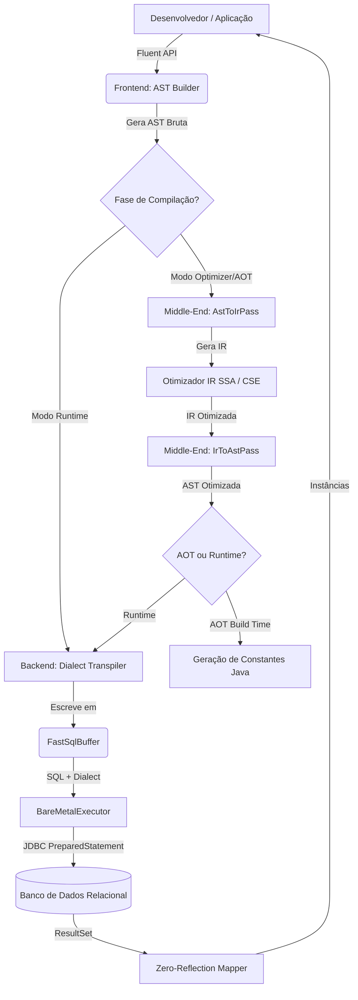
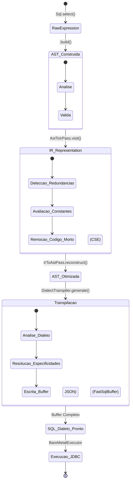
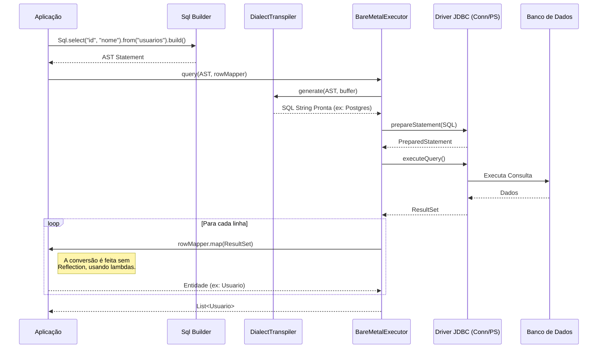

# Documentação Arquitetural: Bare-SQL Engine

Bem-vindo à documentação arquitetural oficial do **Bare-SQL Engine**. Este documento descreve as decisões de design, os componentes principais e os fluxos de dados do motor, com o objetivo de fornecer uma visão aprofundada de como o sistema funciona sob o capô.

---

## 1. Visão Geral e Filosofia

O **Bare-SQL Engine** nasceu da necessidade de se ter um motor de banco de dados e gerador de queries que seja **rápido**, **sem reflexão (zero-reflection)**, **seguro em tempo de compilação (AOT - Ahead-Of-Time)** e **agnóstico a dialetos**.

A principal motivação é eliminar as perdas de performance comuns em ORMs tradicionais (como o Hibernate) e a complexidade de manutenção de suítes de testes pesadas (Testcontainers) ou inconsistentes (H2 Database). O Bare-SQL atinge isso através de uma abordagem baseada em **Compiladores**.

### Decisões de Design:
- **Separação de Fases (Frontend, Middle-end, Backend):** Inspirado em compiladores como LLVM, o motor divide o trabalho em:
  - **Frontend:** Builder Fluente construindo a AST (Abstract Syntax Tree).
  - **Middle-end:** Transformação para IR (Intermediate Representation) e otimizações baseadas em SSA (Static Single Assignment) como CSE (Common Subexpression Elimination).
  - **Backend:** Transpilação de AST para a sintaxe específica do banco (Dialect) e compilação AOT.
- **Zero-Reflection Row Mapping:** Em vez de usar reflexão Java (que é custosa) para mapear resultados `ResultSet` para entidades, usamos lambdas funcionais diretas.
- **Transpilação Agnóstica:** As queries são construídas em uma AST neutra e transpiladas dinamicamente para PostgreSQL, SQLite, MySQL, etc., o que viabiliza o uso de SQLite em memória para 95% dos testes unitários/integração.
- **AOT (Ahead-of-Time):** Capacidade de pré-compilar e resolver as árvores de SQL durante o build time, gerando strings literais constantes, o que zera o overhead de montagem de string em runtime.

---

## 2. Arquitetura do Sistema

O diagrama abaixo ilustra o fluxo de dados desde a chamada do desenvolvedor até a execução no banco de dados.

---

## 3. Ciclo de Vida da Query

A vida de uma query dentro do Bare-SQL passa por várias transformações de estado para garantir segurança, otimização e compatibilidade.

### Detalhamento das Transições:
1. **Frontend (AST):** Os nós da árvore (`Nodes.Select`, `Nodes.BinaryExpr`, etc.) representam a intenção pura, sem amarras com a sintaxe do banco de dados.
2. **Otimização (IR & SSA):** A passagem para IR (Intermediate Representation) mapeia variáveis virtuais e remove duplicações através da eliminação de subexpressões comuns (CSE). Exemplo: `idade > 18 AND idade > 18` vira apenas `idade > 18`.
3. **Backend (Transpiler):** O `DialectTranspiler` pega a AST otimizada e decide regras granulares. Se for SQLite e houver um campo JSON, ele gera `json_extract()`; se for Postgres, ele gera o operador `->>`.

---

## 4. O Fluxo de Execução (Executor)

O `BareMetalExecutor` foi projetado para extrair cada gota de performance do JDBC. Ele gerencia as conexões e os fluxos de dados em lote.

---

## 5. Destaques das Decisões Técnicas

### Por que não usar Hibernate?
O Hibernate é flexível, mas o custo dessa flexibilidade é a utilização massiva de *Java Reflection*, proxies, e um "L1 Cache" complexo que resulta em consumo imprevisível de memória e latência de CPU. O **Bare-SQL** resolve o RowMapping injetando explicitamente uma função lambda funcional (Zero-Reflection), tornando o fluxo de dados em um *pipeline* previsível.

### Estratégia de Testes (SQLite Mocks)
Com o Dialect Transpiler, os testes de CI/CD podem trocar o alvo de compilação de `POSTGRES` para `SQLITE` na hora da injeção de dependência. Isso substitui em ~95% dos casos o H2 Database ou Testcontainers, executando na memória nativa em frações de milissegundos sem perder precisão nas conversões estruturais.

### Ahead-of-Time Compilation (AOT)
Para caminhos críticos ("Hot Paths") na aplicação, a geração do SQL e otimização da AST é feita por um gerador (Mojo Maven/Gradle) que cospe uma classe Java com `public static final String`. Durante o runtime, o motor pula toda a etapa de alocação de buffer e transpilação, batendo direto no JDBC com a string otimizada e imutável.

---

## 6. Conclusão

A arquitetura orientada a compiladores do `bare-sql-engine` o coloca como uma ferramenta moderna, combinando a fluidez das APIs orientadas a objetos com o rigor matemático das otimizações de IR e a performance bruta das execuções estáticas (Bare-Metal e AOT).
