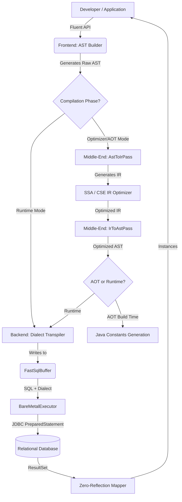
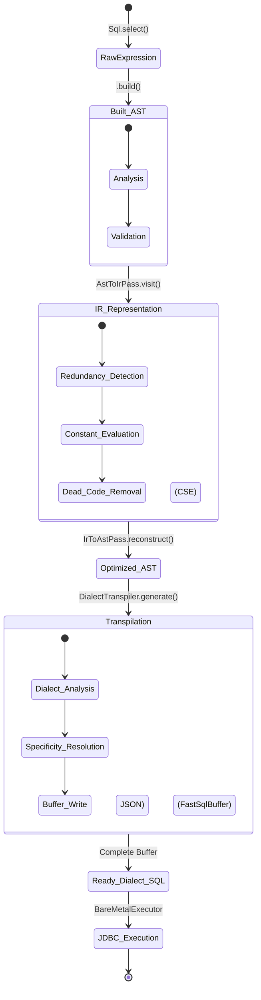
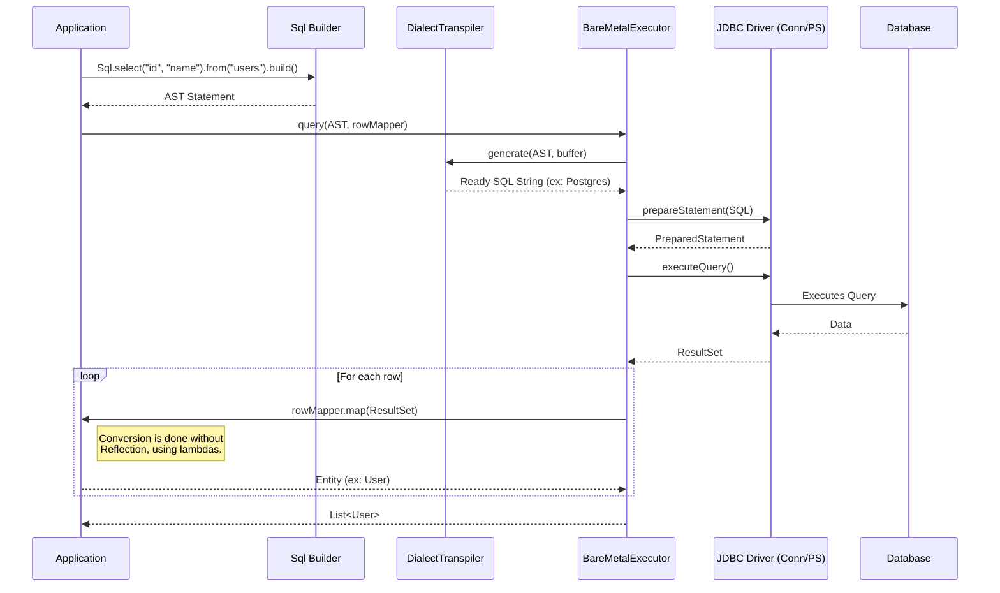

# Architectural Documentation: Bare-SQL Engine

Welcome to the official architectural documentation of the **Bare-SQL Engine**. This document describes the design decisions, main components, and data flows of the engine, aiming to provide an in-depth view of how the system works under the hood.

---

## 1. Overview and Philosophy

The **Bare-SQL Engine** was born from the need to have a database engine and query generator that is **fast**, **zero-reflection**, **compile-time safe (AOT - Ahead-Of-Time)**, and **dialect-agnostic**.

The main motivation is to eliminate performance losses common in traditional ORMs (like Hibernate) and the complexity of maintaining heavy testing suites (Testcontainers) or inconsistent ones (H2 Database). Bare-SQL achieves this through a **Compiler**-based approach.

### Design Decisions:
- **Phase Separation (Frontend, Middle-end, Backend):** Inspired by compilers like LLVM, the engine divides the work into:
  - **Frontend:** Fluent Builder constructing the AST (Abstract Syntax Tree).
  - **Middle-end:** Transformation to IR (Intermediate Representation) and SSA (Static Single Assignment)-based optimizations like CSE (Common Subexpression Elimination).
  - **Backend:** AST Transpilation to the specific database syntax (Dialect) and AOT compilation.
- **Zero-Reflection Row Mapping:** Instead of using Java reflection (which is costly) to map `ResultSet` results to entities, we use direct functional lambdas.
- **Agnostic Transpilation:** Queries are built in a neutral AST and dynamically transpiled to PostgreSQL, SQLite, MySQL, etc., which makes it feasible to use in-memory SQLite for 95% of unit/integration tests.
- **AOT (Ahead-of-Time):** Ability to pre-compile and resolve SQL trees during build time, generating constant literal strings, which zeroes out string assembly overhead at runtime.

---

## 2. System Architecture

The diagram below illustrates the data flow from the developer's call to the execution in the database.

---

## 3. Query Lifecycle

The life of a query inside Bare-SQL goes through several state transformations to ensure safety, optimization, and compatibility.

### Transition Details:
1. **Frontend (AST):** The tree nodes (`Nodes.Select`, `Nodes.BinaryExpr`, etc.) represent the pure intent, unattached to the database syntax.
2. **Optimization (IR & SSA):** The pass to IR (Intermediate Representation) maps virtual variables and removes duplications through common subexpression elimination (CSE). Example: `age > 18 AND age > 18` becomes just `age > 18`.
3. **Backend (Transpiler):** The `DialectTranspiler` takes the optimized AST and decides granular rules. If it's SQLite and there is a JSON field, it generates `json_extract()`; if it's Postgres, it generates the `->>` operator.

---

## 4. The Execution Flow (Executor)

The `BareMetalExecutor` was designed to extract every drop of performance from JDBC. It manages connections and batch data flows.

---

## 5. Technical Decision Highlights

### Why not use Hibernate?
Hibernate is flexible, but the cost of this flexibility is the massive use of *Java Reflection*, proxies, and a complex "L1 Cache" that results in unpredictable memory consumption and CPU latency. **Bare-SQL** solves RowMapping by explicitly injecting a functional lambda (Zero-Reflection), making the data flow a predictable *pipeline*.

### Testing Strategy (SQLite Mocks)
With the Dialect Transpiler, CI/CD tests can swap the compilation target from `POSTGRES` to `SQLITE` at dependency injection time. This replaces H2 Database or Testcontainers in ~95% of cases, running in native memory in fractions of milliseconds without losing precision in structural conversions.

### Ahead-of-Time Compilation (AOT)
For critical paths ("Hot Paths") in the application, SQL generation and AST optimization is done by a generator (Maven/Gradle Mojo) that spits out a Java class with `public static final String`. During runtime, the engine skips the entire buffer allocation and transpilation step, hitting JDBC directly with the optimized and immutable string.

---

## 6. Conclusion

The compiler-driven architecture of `bare-sql-engine` positions it as a modern tool, combining the fluidity of object-oriented APIs with the mathematical rigor of IR optimizations and the raw performance of static executions (Bare-Metal and AOT).